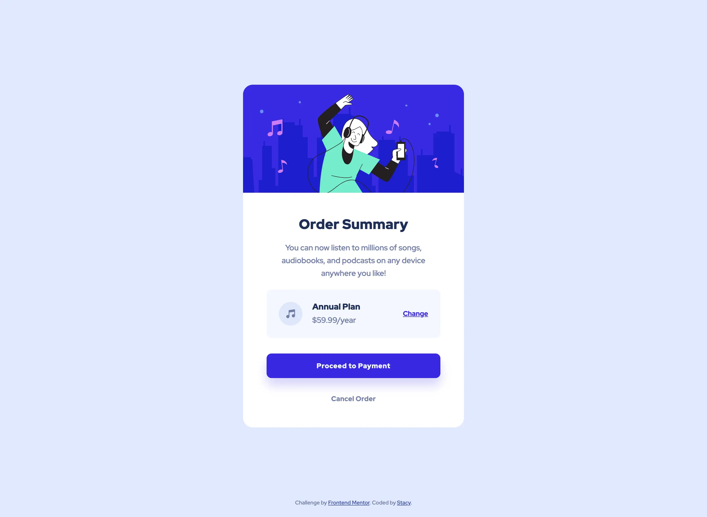

# Frontend Mentor - Order summary card solution

This is a solution to the [Order summary card challenge on Frontend Mentor](https://www.frontendmentor.io/challenges/order-summary-component-QlPmajDUj). Frontend Mentor challenges help you improve your coding skills by building realistic projects.

### Screenshot




### Links

- Live Site URL: https://stautuan.github.io/order-summary-component-main/

## My process

### Built with

- Semantic HTML5 markup
- CSS custom properties
- Flexbox

### What I learned

I've been using hexadecimals for these challenges but I've decided to experiment with HSL for this one, and I'm not sure if I like it yet. However, I did learn from Kevin Powell the correct syntax of writing it to easily set the opacity, and it's pretty cool.

```css
:root {
  --clr-bright-blue: 245 75% 52%;
}

button {
  box-shadow: 0 1.5rem 2rem hsl(var(--clr-bright-blue) / 0.2);
}
```

### Continued development

I will be adopting HSL over hexadecimal color codes moving forward. It appears to be the preferred standard and professionals are using it.

### Useful resources

- [Open up new possibilities with custom properties and HSL](https://www.youtube.com/watch?v=IHaT_rjC2gM&ab_channel=KevinPowell) - It makes sense why this approach might be the most effective way of setting your colors; adjusting colors becomes significantly easier. When I applied it to set the hover color of the button, which was not specified in the style guid, I believe I managed to closely match the design file.

## Author

- Frontend Mentor - [@stautuan](https://www.frontendmentor.io/profile/stautuan)

## Acknowledgments

Thank you to Kevin Powell!
